# Image Matting 调研与简单 Demo

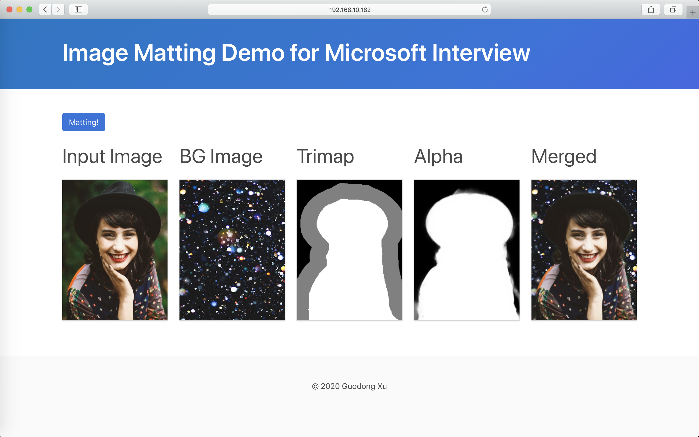

## 前期调研

- 初步设想：直接用图像分割做一个硬的前景提取，但是这样生成的合成图像边缘会很粗糙。
- Image matting任务
    - $I_{i}=\alpha_{i} F_{i}+\left(1-\alpha_{i}\right) B_{i}, \quad \alpha_{i} \in[0,1]$
    - 输入：原始图像$I$
        - (optional) Trimap：用来确认混合像素，可以由人工标注，或者利用结构和形状等特征进行预测。
        - Adobe 的 Deep Image Matting 中提供了一个利用alpha来生成trimap的算法，可以用来进行模型训练。
            - 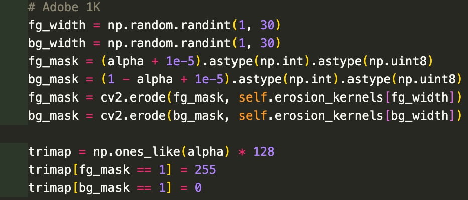
    - 输出：$\alpha$。
- 主流数据集
    - [Adobe Composition-1k](https://sites.google.com/view/deepimagematting)
        - train: 431前景+alpha, 43100合成图
        - val: 50前景+alpha, 1000合成图 + 1000 trimap
    - [alphamatting.com](http://www.alphamatting.com/datasets.php)
        - train: 27前景，3种不同的trimap，alpha
        - val: 8前景，3种不同的trimap
    - notes: 由于前景图比较少，一般会和COCO, VOC之类的背景图进行组合来训练。
- 评估指标
    - Sum of Absolute Differences (SAD)
    - Mean Squared Error (MSE)
    - Gradient error (Grad)
    - Connectivity error (Conn)
- 近期论文
    - 总体流程
        - 训练输入：前景，背景，alpha（利用三者可以生成合成的混合图像）
        - 评估输入：混合图片，trimap, alpha
    - AAAI 2020
        - [Natural Image Matting via Guided Contextual Attention](https://github.com/Yaoyi-Li/GCA-Matting)
            - 目前开源的效果在alphamatting.com上最好的
    - CVPR 2019
        - A Late Fusion CNN for Digital Matting
        - Learning-Based Sampling for Natural Image Matting
    - ICCV 2019
        - [Indices Matter: Learning to Index for Deep Image Matting](https://github.com/poppinace/indexnet_matting)
            - 目前开源的效果在alphamatting.com上第二好的，但是没有提供训练代码。
        - Disentangled Image Matting
        - Context-Aware Image Matting for Simultaneous Foreground and Alpha Estimation
        - Generative Adversarial Training for Weakly Supervised Cloud Matting

## 初步实验

### 测试代码

- 决定选择开源效果最好的[Natural Image Matting via Guided Contextual Attention](https://github.com/Yaoyi-Li/GCA-Matting)论文了解image matting整个pipeline如何工作。
- 该代码在alphamatting只提供了test，效果如下。

```bash
python demo.py \
--config=config/gca-dist-all-data.toml \
--checkpoint=gca-dist-all-data.pth \
--image-dir=demo/input_lowres \
--trimap-dir=demo/trimap_lowres/Trimap3 \
--output=demo/pred/Trimap3/
```


| Input: Image | Input: Trimap | Output: Alpha |
|--------------|---------------|---------------|
|      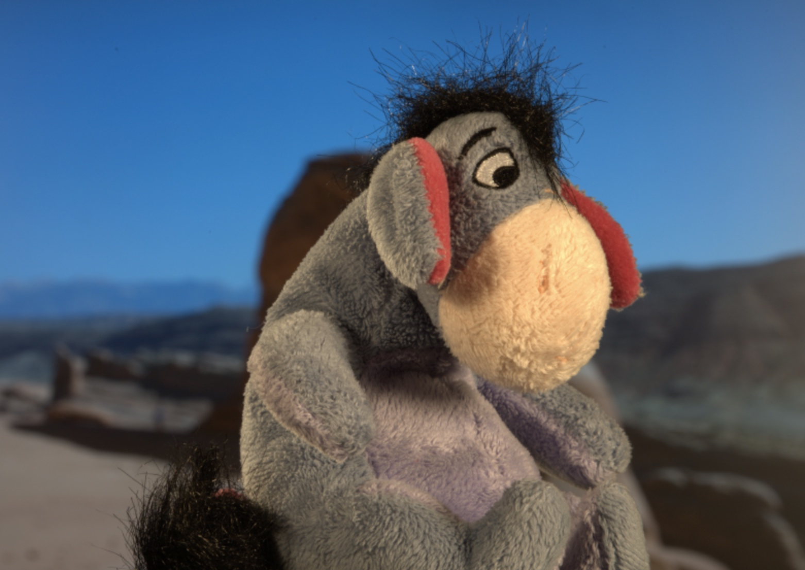|        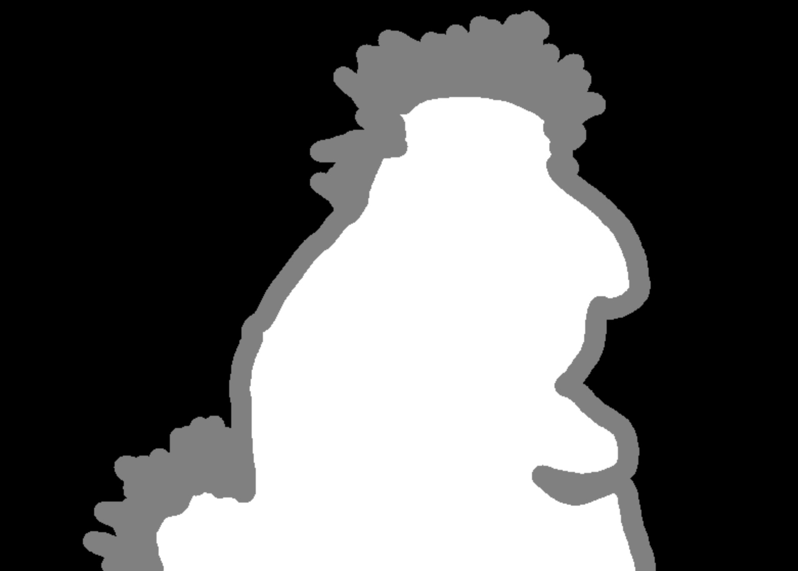|        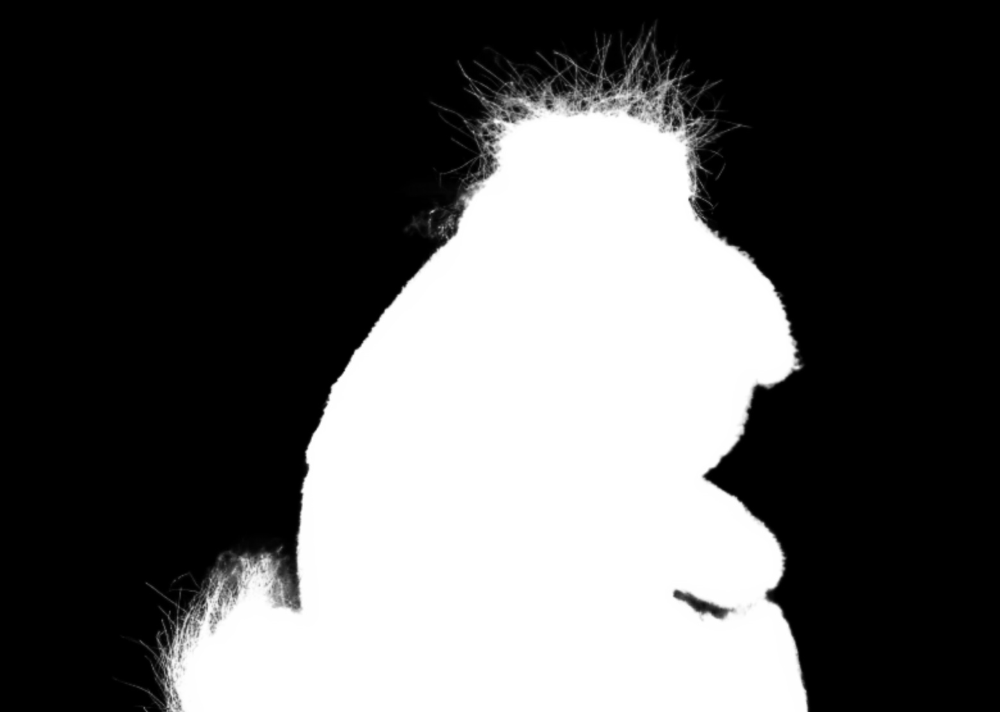|

### 分析GCA代码

- 训练数据：利用alpha生成trimap，bn + fn + alpha生成混合图像
- 测试数据：混合图像，任意方法生成的trimap
- 模型结构：主要的创新是引入了一个guided contextual attention module，使得高维的alpha特征显式的在低维的特征(高分辨率)指导下进行传播学习，从而同时融合low-level以及high-level信息，避免了在高分辨率的低维特征下进行传播的较大计算量。
- 核心结构类似U-Net，多插入了一个高分辨率图像信息来作为context指导学习。

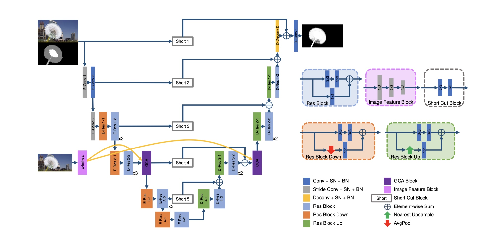

## 人像matting流程设计

- 由上面的调研，可以初步确定进行人像matting过程。
    1. 准备若干人像前景图片，对应的alpha标注，若干背景图片，训练一个image matting模型。
    2. 在视频流中，实时根据当前图像生成trimap。
        - 所以现在遗留了一个问题是如何生成trimap。经过查阅发现 https://github.com/foamliu/Deep-Image-Matting/issues/26，https://github.com/foamliu/Deep-Image-Matting/issues/5 这两个issue中提到了这个问题。结论的想法是在用一个分割模型来做二分类的人像分割，在对分割图进行一定的膨胀腐蚀得到trimap。
    3. 然后由matting模型输入混合图像+trimap生成alpha。
    4. 之后直接利用公式$I_{i}=\alpha_{i} F_{i}+\left(1-\alpha_{i}\right) B_{i}, \quad \alpha_{i} \in[0,1]$就可以得到拼接图了（这里实际做了一定的简化，假设了原图就是前景图，但是实际上边缘部分merge了部分背景像素）。

### 生成trimap

图片中的人像分割问题相对更成熟，我这里简单的用pretrained 的 unet完成这个目标。生成后进行一定的膨胀腐蚀即可生成trimap。核心代码如下。

```python
def gen_trimap(segmentation_mask):
    k_size = 7
    iterations = 6
    kernel = cv2.getStructuringElement(cv2.MORPH_ELLIPSE, (k_size, k_size))
    dilated = cv2.dilate(segmentation_mask, kernel, iterations=iterations)
    eroded = cv2.erode(segmentation_mask, kernel, iterations=iterations)
    trimap = np.zeros(segmentation_mask.shape, dtype=np.uint8)
    trimap.fill(128)

    trimap[eroded >= 255] = 255
    trimap[dilated <= 0] = 0
    return trimap
```

经过实验发现膨胀腐蚀的尺度需要仔细的调整，否则对matting的影响比较大。

如当k = 2时。

| Input: Image | Segmentation | Output: Trimap/Alpha/Merged |
|--------------|---------------|---------------|
|   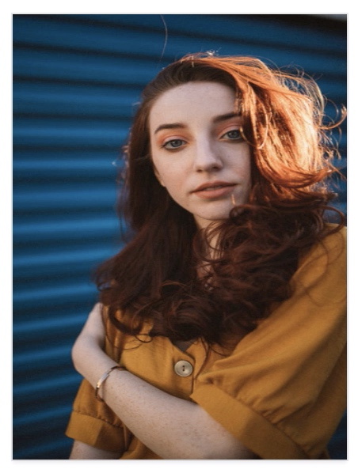|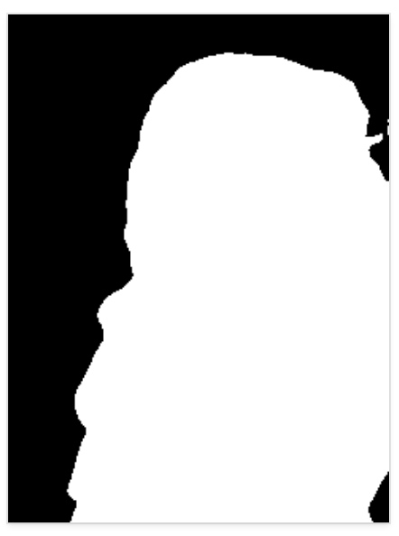|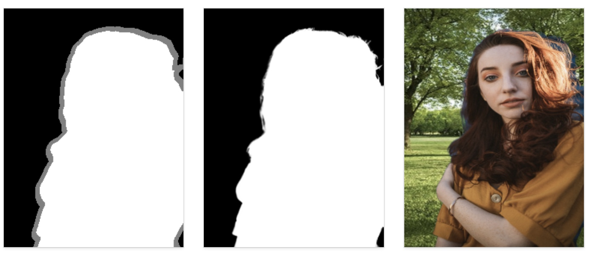|

当k = 12时。

| Input: Image | Segmentation | Output: Trimap/Alpha/Merged |
|--------------|---------------|---------------|
|   ||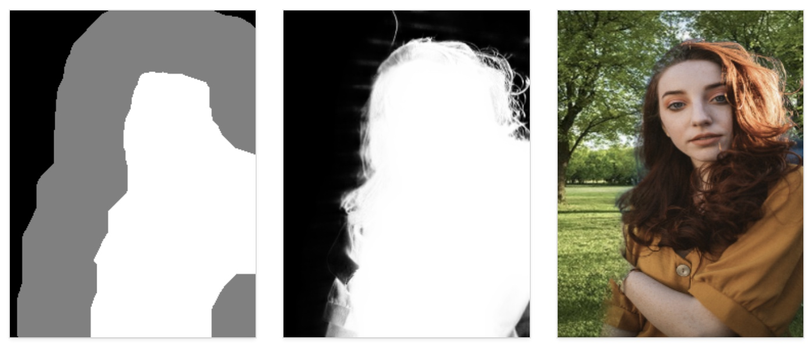|

当k = 7时。

| Input: Image | Segmentation | Output: Trimap/Alpha/Merged |
|--------------|---------------|---------------|
|   ||  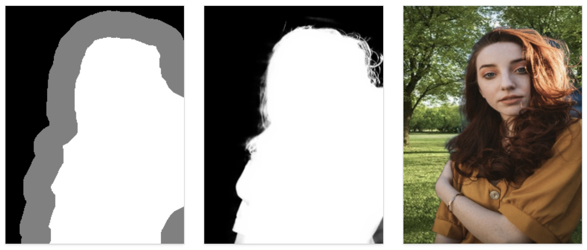|


### 生成alpha

有了trimap图，就可以直接用GCA网络来生成alpha图了


| Input: Image |  Segmentation | Trimap | Output: Alpha|
|--------------|---------------|---------------|-----------|
|   ||      |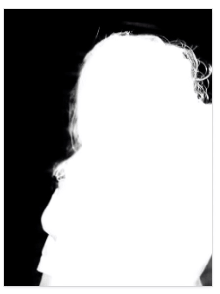|

### 拼接

最后只需要按照公式$I_{i}=\alpha_{i} F_{i}+\left(1-\alpha_{i}\right) B_{i}, \quad \alpha_{i} \in[0,1]$和背景图进行拼接即可。

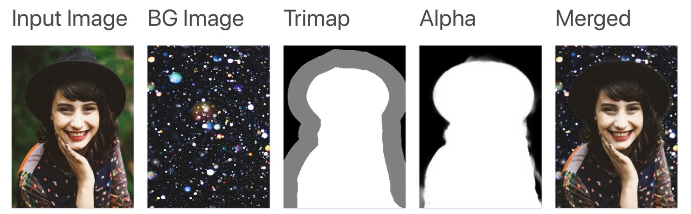
这样整个工作就完成了。

### 演示

这里简单的搭建了一个前端串起了整个流程作为演示。


输入即带人的图片+背景图，输出即合成的图片。

代码前后端环境基于docker-compose，直接运行`docker-compose up`就会在对应的端口开启服务。

## 后续工作

- 数据：本次调研使用的两个模型均为公开数据集上训练的，如果有应用场所对应的数据集进行训练效果会更好。
- 模型：
    - Image matting模型使用了SOTA的开源模型，没有进行改动，如果能结合具体的任务与其他论文的一些技巧进行修改，应该会达到更好的效果。
    - Trimap生成使用了一个图像分割模型，这里使用的比较简单的UNet，我们可以采用更高级的分割模型如deep-lab，这也有很大的进步空间。
    - 显然这里的Trimap生成用的UNet可以与Image matting的模型进行部分的模型共享，从而减少计算量，实现端对端的Inference，此外两个任务融合也可能可以加强两者共同的效果。
- 假设：这里假设了原图就是前景$F$，这方面的工作应该也有较大的优化空间。
- 上线：由于使用了两个模型，一般视频流需要30FPS，所以对模型有一定的优化需求，不过由于这两个模型都是全卷积的，配合GPU，TensorRT，DALI，float16应该有非常大的优化空间。（录制的视频是在我本地的i7 CPU上跑的）

## 参考

- https://sites.google.com/view/deepimagematting
- http://www.alphamatting.com/datasets.php
- https://github.com/Yaoyi-Li/GCA-Matting
- https://github.com/poppinace/indexnet_matting
- https://github.com/lizhengwei1992/Semantic_Human_Matting/issues
- https://github.com/foamliu/Deep-Image-Matting-PyTorch
- https://github.com/nizhib/portrait-demo